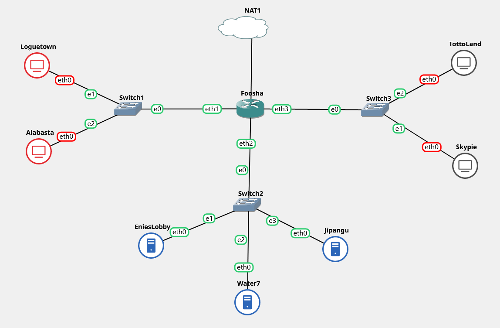

# Jarkom-Modul-2-T14-2021

Anggota Kelompok :
- Dida Prasetyo Rahmat - 05311940000019 
- Revina Rahmanisa Harjanto - 05311940000046 

## 1. Luffy bersama Zoro berencana membuat peta tersebut dengan kriteria EniesLobby sebagai DNS Server, Jipangu sebagai DHCP Server, Water7 sebagai Proxy Server



Membuat topologi seperti pada gambar, lalu melakukan konfigurasi dan menjalankan perintah yang sudah ditambahkan pada /root/.bashrc

### a. Foosha
- konfigurasi
```
auto eth0
iface eth0 inet dhcp

auto eth1
iface eth1 inet static
    address 192.218.1.1
    netmask 255.255.255.0

auto eth2
iface eth2 inet static
    address 192.218.2.1
    netmask 255.255.255.0

auto eth3
iface eth3 inet static
    address 192.218.3.1
    netmask 255.255.255.0
```
- bashrc
```
iptables -t nat -A POSTROUTING -o eth0 -j MASQUERADE -s 192.218.0.0/16
apt-get update
apt-get install nano
echo -e "y\n192.218.2.4\neth1 eth3 eth2\n\n" | apt-get install isc-dhcp-relay

bash /root/shell.sh
```

### b. Loguetown, Alabasta, TottoLand
- konfigurasi
```
auto eth0
iface eth0 inet dhcp
```
- bashrc
```
apt-get update
apt-get install nano
apt-get install lynx -y

bash /root/shell.sh
```

### c. Skypie
- konfigurasi
```
auto eth0
iface eth0 inet dhcp
hwaddress ether 6a:29:cd:ad:5a:db
```
- bashrc
```
apt-get update
apt-get install nano
apt-get install apache2 -y
apt-get install php -y
apt-get install libapache2-mod-php7.0
apt-get install wget -y
apt-get install unzip -y

bash /root/shell.sh
```

### d. EniesLobby
- konfigurasi
```
auto eth0
iface eth0 inet static
    address 192.218.2.2
    netmask 255.255.255.0
    gateway 192.218.2.1
```
- bashrc
```
echo nameserver 192.168.122.1 > /etc/resolv.conf
apt-get update
apt-get install nano
apt-get install bind9 -y

bash /root/shell.sh
```

- konfigurasi DNS
1. `/etc/bind/named.conf.local`
```
zone "super.franky.TI14.com" {
    type master;
    file "/etc/bind/kaizoku/super.franky.TI14.com";
};
```
2. `/etc/bind/named.conf.options`
```
options {
    directory "/var/cache/bind";
    // forwarders {
    //      0.0.0.0;
    // };
        
    //dnssec-validation auto;
    allow-query{any;};

    auth-nxdomain no;    # conform to RFC1035
    listen-on-v6 { any; };
};
```
3. `/etc/bind/kaizoku/super.franky.TI14.com`
```
$TTL    604800
@       IN      SOA     super.franky.TI14.com. root.super.franky.TI14.com. (
                        2021110901      ; Serial
                         604800         ; Refresh
                          86400         ; Retry
                        2419200         ; Expire
                         604800 )       ; Negative Cache TTL
;
@       IN      NS      super.franky.TI14.com.
@       IN      A       192.218.3.69
www     IN      CNAME   super.franky.TI14.com.
```

### e. Water7
- konfigurasi
```
auto eth0
iface eth0 inet static
    address 192.218.2.3
    netmask 255.255.255.0
    gateway 192.218.2.1
```
- bashrc
```
echo nameserver 192.168.122.1 > /etc/resolv.conf
apt-get update
apt-get install nano
apt-get install squid -y
apt-get install apache2-utils -y

bash /root/shell.sh
```

### f. Jipangu
- konfigurasi
```
auto eth0
iface eth0 inet static
    address 192.218.2.4
    netmask 255.255.255.0
    gateway 192.218.2.1
```
- bashrc
```
echo nameserver 192.168.122.1 > /etc/resolv.conf
apt-get update
apt-get install nano
apt-get install isc-dhcp-server -y

bash /root/shell.sh
```

## 2. dan Foosha sebagai DHCP Relay

- `/etc/default/isc-dhcp-relay` (Foosha)
```
# What servers should the DHCP relay forward requests to?
SERVERS="192.218.2.4"

# On what interfaces should the DHCP relay (dhrelay) serve DHCP requests?
INTERFACES="eth1 eth3 eth2"

# Additional options that are passed to the DHCP relay daemon?
OPTIONS=""
```

## 3 - 6. Luffy dan Zoro menyusun peta tersebut dengan hati-hati dan teliti.

Ada beberapa kriteria yang ingin dibuat oleh Luffy dan Zoro, yaitu:
1. Semua client yang ada HARUS menggunakan konfigurasi IP dari DHCP Server.
2. Client yang melalui Switch1 mendapatkan range IP dari [prefix IP].1.20 - [prefix IP].1.99 dan [prefix IP].1.150 - [prefix IP].1.169
3. Client yang melalui Switch3 mendapatkan range IP dari [prefix IP].3.30 - [prefix IP].3.50
4. Client mendapatkan DNS dari EniesLobby dan client dapat terhubung dengan internet melalui DNS tersebut.
5. Lama waktu DHCP server meminjamkan alamat IP kepada Client yang melalui Switch1 selama 6 menit sedangkan pada client yang melalui Switch3 selama 12 menit. Dengan waktu maksimal yang dialokasikan untuk peminjaman alamat IP selama 120 menit.

- `/etc/default/isc-dhcp-server` (Jipangu)
```
INTERFACES="eth0"
```

- `/etc/dhcp/dhcpd.conf` (Jipangu)
```
subnet 192.218.1.0 netmask 255.255.255.0 {
    range 192.218.1.20 192.218.1.99;
    range 192.218.1.150 192.218.1.169;
    option routers 192.218.1.1;
    option broadcast-address 192.218.1.255;
    option domain-name-servers 192.218.2.2;
    default-lease-time 360;
    max-lease-time 7200;
}

subnet 192.218.3.0 netmask 255.255.255.0 {
    range 192.218.3.30 192.218.3.50;
    option routers 192.218.3.1;
    option broadcast-address 192.218.3.255;
    option domain-name-servers 192.218.2.2;
    default-lease-time 720;
    max-lease-time 7200;
}

subnet 192.218.2.0 netmask 255.255.255.0 {
}
```

## 7. Luffy dan Zoro berencana menjadikan Skypie sebagai server untuk jual beli kapal yang dimilikinya dengan alamat IP yang tetap dengan IP [prefix IP].3.69

- `/etc/dhcp/dhcpd.conf` (Jipangu)
```
host Jipangu {
    hardware ethernet 6a:29:cd:ad:5a:db;
    fixed-address 192.218.3.69;
}
```
## 8. Loguetown digunakan sebagai client Proxy agar transaksi jual beli dapat terjamin keamanannya, juga untuk mencegah kebocoran data transaksi.

Pada Loguetown, proxy harus bisa diakses dengan nama jualbelikapal.yyy.com dengan port yang digunakan adalah 5000

- `/etc/bind/named.conf.local` (EniesLobby)
```
zone "jualbelikapal.TI14.com" {
    type master;
    file "/etc/bind/kaizoku/jualbelikapal.TI14.com";
};
```

- `/etc/bind/kaizoku/jualbelikapal.TI14.com` (EniesLobby)
```
$TTL    604800
@       IN      SOA     jualbelikapal.TI14.com. root.jualbelikapal.TI14.com. (
                        2021110901      ; Serial
                         604800         ; Refresh
                          86400         ; Retry
                        2419200         ; Expire
                         604800 )       ; Negative Cache TTL
;
@       IN      NS      jualbelikapal.TI14.com.
@       IN      A       192.218.2.3
www     IN      CNAME   jualbelikapal.TI14.com.
```

- `/etc/squid/squid.conf` (Water7)
```
http_port 5000
visible_hostname Water7

http_access allow all
```

## 9. Agar transaksi jual beli lebih aman dan pengguna website ada dua orang, proxy dipasang autentikasi user proxy dengan enkripsi MD5 dengan dua username, yaitu luffybelikapalyyy dengan password luffy_yyy dan zorobelikapalyyy dengan password zoro_yyy

- membuat user (Water7)
```
htpasswd -cbm /etc/squid/passwd luffybelikapalTI14 luffy_TI14
htpasswd -bm /etc/squid/passwd zorobelikapalTI14 zoro_TI14
```

- `/etc/squid/squid.conf` (Water7)
```
http_port 5000
visible_hostname Water7

auth_param basic program /usr/lib/squid/basic_ncsa_auth /etc/squid/passwd
auth_param basic children 5
auth_param basic realm Proxy
auth_param basic credentialsttl 2 hours
auth_param basic casesensitive on
acl USERS proxy_auth REQUIRED
http_access allow USERS
```
